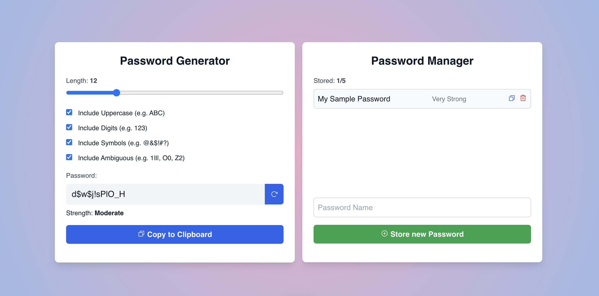

# Alpine Password Manager

Alpine Password Manager is a simple password manager built with Alpine.js. It lets you generate passwords for different websites based on criteria you define and store them. Passwords are stored in the browser's local memory.

**Demo: [alpine-password-manager.vercel.app](https://alpine-password-manager.vercel.app)**

[](https://alpine-password-manager.vercel.app)

## Features

- **Generate Passwords**: Generate passwords based on criteria you define.
- **Store Passwords**: Store passwords for different websites.
- **Copy Passwords**: Copy passwords to the clipboard.
- **Delete Passwords**: Delete passwords from the list.
- **Local Storage:** Passwords are stored in the local storage.
- **Responsive Design**: The application is responsive and works on all devices.

## Tech Stack


- **Framework**: [Alpine.js](https://alpinejs.dev)
- **Styling**: [Tailwind CSS](https://tailwindcss.com)
- **Build Tool**: [Vite](https://vite.dev)
- **Deployment**: [Vercel](https://vercel.com)

## Getting Started

To get started with this project, follow these steps:

1. **Clone the repository**:

   ```sh
   git clone https://github.com/zorkham/alpine-markt.git
   ```

2. **Install dependencies**:

   ```sh
   pnpm install
   ```

3. **Run project locally**:

   ```sh
   pnpm dev
   ```

4. **Open your browser**: Go to `http://localhost:3000` to see the app in action.

## Other Projects

- [Alpine Markt](https://github.com/Zorkham/alpine-markt)
- [Alpine Board Game Explorer](https://github.com/Zorkham/alpine-board-game-explorer)
- [Alpine Pokedex](https://github.com/Zorkham/alpine-pokedex)
